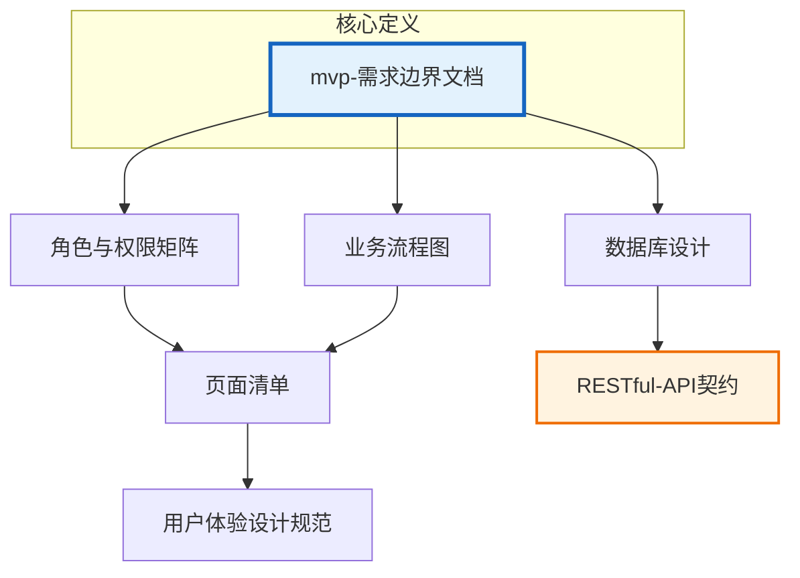

# 项目全景说明

片场租赁计时管理系统

---

## 一句话项目定位

面向影视剧组的小时制片场租赁计时管理平台，会员扫码入场、按场地和设备计时付费，管理员现场核验并放行。

---

## 文档地图

| 文档 | 解决什么问题 | 依赖关系 |
|------|-------------|----------|
| **mvp-需求边界文档** | 定义 MVP 范围、核心流程、角色、功能列表、Scope Out | 基础文档，其他文档均以此为准 |
| **业务流程图** | 用 Mermaid 展示主流程、异常流、状态机 | 依赖需求边界文档 |
| **角色与权限矩阵** | 定义会员/管理员权限、权限对照表、日志类型 | 依赖需求边界文档 |
| **数据库设计** | ER 图、表结构、字段说明、索引、初始化数据 | 依赖需求边界文档 |
| **页面清单** | 前后端所有页面目标、信息、操作、跳转关系 | 依赖业务流程图、权限矩阵 |
| **RESTful-API 契约** | 完整的 RESTful 风格 API 契约，包含验证规则 | 依赖数据库设计、页面清单 |
| **用户体验设计规范** | 移动端/H5 适配规范、组件规范、错误处理 | 依赖页面清单 |

---

## 文档关系图（Mermaid）

---

## 核心业务闭环（3 段）

1. **入场阶段**：会员注册登录 → 充值余额 → 选择场地和设备 → 扫码入场 → 系统记录入场时间并模拟开门放行。使用过程中可申请部分人离场（需管理员审核）。

2. **离场结算阶段**：会员申请离场 → 系统计算费用（时长×场地单价+设备费用）→ 判断余额是否充足 → 余额不足则提示补差价 → 推送账单给管理员。

3. **审核放行阶段**：管理员收到账单通知 → 核验资产、可添加额外费用（损坏赔偿/清洁费）→ 确认扣款 → 手动放行 → 会员收到账单通知 → 订单完成。

---

## 角色与权限一句话总结

会员用户（剧组负责人）可自主操作入场、离场、充值、查看个人订单；管理员掌控场地设备管理、订单审核、账单调整、扣款放行全部权限。

---

## 状态机一句话总结

订单状态按序流转：待入场 → 入场中 →（部分人离场待审核）→ 离场申请 → 待审核/补差价待审核 → 审核中 → 已审核 → 已扣款 → 已放行 → 已完成，拒单可返回入场中。

---

## 数据模型一句话总结

核心四表：会员（余额）、场地（时价）、设备（次价）、订单（关联场地设备、记录时间费用）；配套表：订单设备关联、部分人离场记录、补差价记录、管理员、操作日志、通知、管理员审核记录。

---

## 一致性检查表

| 问题 | 所在文档 | 状态 |
|------|----------|------|
| ~~状态名称不一致：`补差价待审核` vs `审核中`~~ | ~~业务流程图 vs 角色与权限矩阵~~ | ✅ 已统一为 `topup_pending` |
| ~~状态流转重复：`待审核` 出现两次~~ | ~~角色与权限矩阵~~ | ✅ 已删除冗余步骤 |
| ~~权限码不完整：缺少 `log.list` 详细定义~~ | ~~角色与权限矩阵~~ | ✅ 已与数据库设计中的 action 码对齐 |
| ~~认证方式不一致：`Session / Token` vs `Bearer Token`~~ | ~~API接口设计 vs RESTful-API契约~~ | ✅ 已统一为 Bearer Token |
| ~~管理员登录路径不一致：`/admin/auth/login` vs `/admin/login`~~ | ~~API接口设计 vs RESTful-API契约~~ | ✅ 已统一为 `/api/v1/admin/auth/login`（已删除 API接口设计，保留 RESTful-API契约） |
| ~~订单状态缺失：`reviewing`（审核中）未在业务流程图状态机体现~~ | ~~业务流程图~~ | ✅ 已补充 `reviewing` 状态 |
| ~~金额字段命名：`base_amount` vs `基础费用`~~ | ~~数据库设计 vs 其他文档~~ | ✅ 已统一使用 `base_amount` |
| ~~日志动作码不一致：`partial_exit_approve` vs `审核部分人离场`~~ | ~~数据库设计 vs 角色与权限矩阵~~ | ✅ 已统一使用动作码格式 |
| **文档重复：API接口设计 vs RESTful-API契约** | 需保留一份 | ✅ 已删除 API接口设计，保留 RESTful-API契约 |

---

## 统一术语表

| 术语 | 统一值 | 说明 |
|------|--------|------|
| 订单状态码 | `pending_entry` | 待入场 |
| 订单状态码 | `entering` | 入场中 |
| 订单状态码 | `partial_exit_pending` | 部分人离场待审核 |
| 订单状态码 | `pending_exit` | 离场申请 |
| 订单状态码 | `topup_pending` | 补差价待审核 |
| 订单状态码 | `reviewing` | 审核中 |
| 订单状态码 | `rejected` | 已拒单 |
| 订单状态码 | `completed` | 已完成 |
| 日志动作码 | `entry` | 扫码入场 |
| 日志动作码 | `partial_exit_apply` | 申请部分人离场 |
| 日志动作码 | `partial_exit_approve` | 审核部分人离场（通过） |
| 日志动作码 | `partial_exit_reject` | 审核部分人离场（拒绝） |
| 日志动作码 | `exit_apply` | 申请离场 |
| 日志动作码 | `topup_apply` | 申请补差价 |
| 日志动作码 | `topup_approve` | 审核补差价（通过） |
| 日志动作码 | `topup_reject` | 审核补差价（拒绝） |
| 日志动作码 | `bill_approve` | 账单审核（通过） |
| 日志动作码 | `bill_reject` | 账单审核（拒绝/拒单） |
| 日志动作码 | `paid` | 已扣款 |
| 日志动作码 | `released` | 已放行 |
| 认证方式 | Bearer Token | Header: `Authorization: Bearer <token>` |
| API基础路径 | `/api/v1` | - |
| 管理员登录路径 | `/api/v1/admin/auth/login` | - |
| 金额字段 | `base_amount` | 基础费用 |
| 金额字段 | `extra_amount` | 额外费用 |
| 金额字段 | `final_amount` | 最终费用 |

---

文档版本：v1.0
更新日期：2026-01-14
