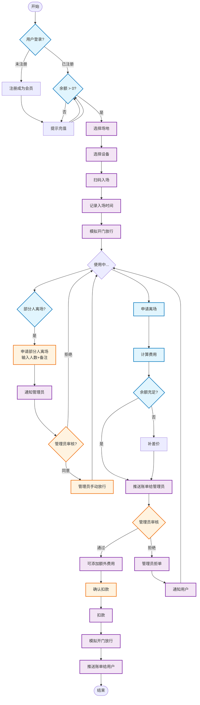
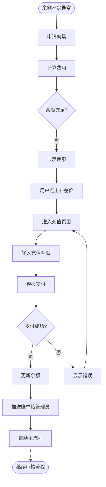
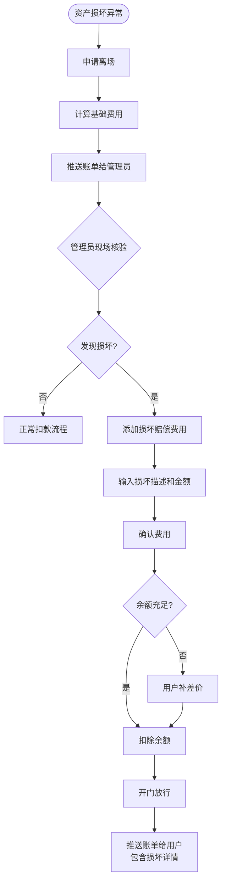
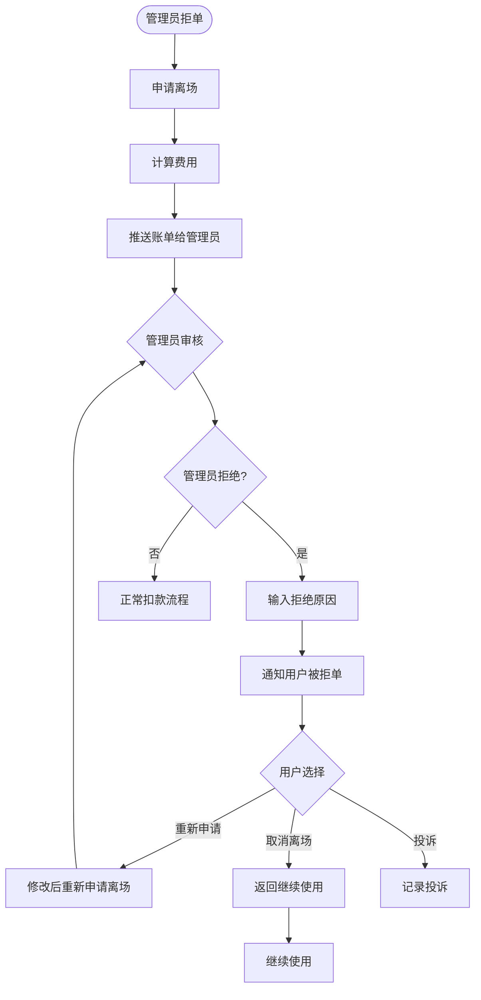
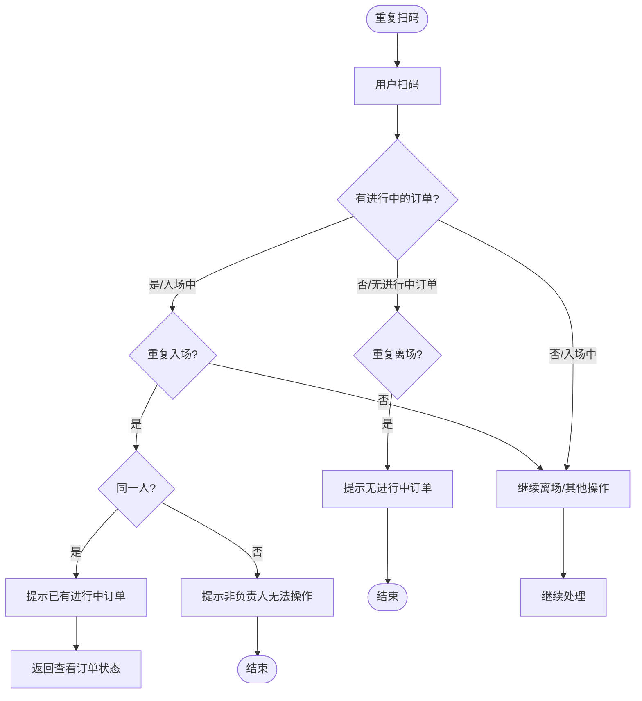
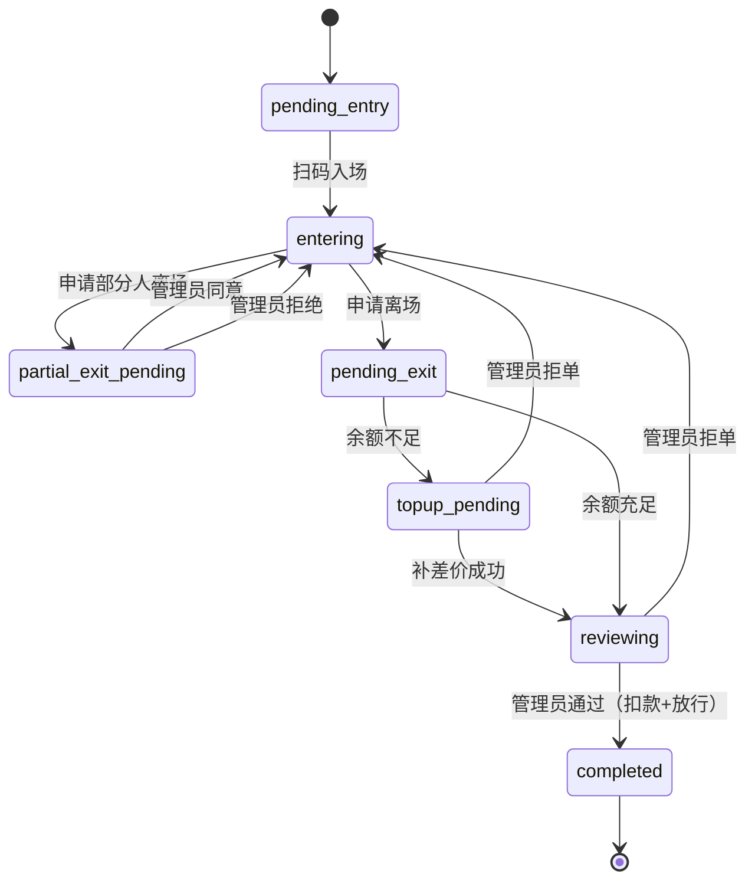

# 业务流程图（Mermaid）

> 本文档使用 Mermaid 语法渲染，建议使用支持 Mermaid 的编辑器查看（如 VS Code、Typora、GitHub）

---

## 主流程



---

## 异常流 1：余额不足



---

## 异常流 2：忘记离场

```mermaid
flowchart TD
    Start([忘记离场异常]) --> Using[使用中]
    Using --> Timeout{超过营业时间?]

    %% 方案A：自动结算
    Timeout -->|是| AutoCalc[系统自动计算费用]
    AutoCalc --> CheckBalanceAuto{余额充足?}
    CheckBalanceAuto -->|是| AutoNotify[推送账单给管理员]
    AutoNotify --> AutoEnd[结束<br/>等待管理员处理]
    CheckBalanceAuto -->|否| AutoAlert[提示余额不足<br/>等待用户处理]

    %% 方案B：人工催办
    Timeout -->|否| Idle{长时间无操作?}
    Idle -->|是| Remind[系统提醒用户]
    Remind --> StillUsing{用户回应?}
    StillUsing -->|是| ContinueUse[继续使用]
    StillUsing -->|否| ForceExit[强制结算]

    ForceExit --> AutoCalc

    class Timeout,AutoCalc,CheckBalanceAuto,AutoNotify,AutoEnd,AutoAlert,Idle,Remind,StillUsing,ContinueUse,ForceExit system
    class StillUsing,ContinueUse user
```

---

## 异常流 3：资产损坏



---

## 异常流 4：管理员拒单



---

## 异常流 5：重复扫码



---

## 状态机总览



---

文档版本：v1.0
更新日期：2026-01-14
