# 数据库设计

## ER 图

```mermaid
erDiagram
    %% 会员表
    Member ||--o{ Order : places
    Member {
        int id PK
        string name
        string phone
        string wechat_openid
        decimal balance "余额"
        datetime created_at
        datetime updated_at
    }

    %% 场地表
    Venue ||--o{ Order : contains
    Venue {
        int id PK
        string name "场地名称"
        decimal price_per_hour "每小时价格"
        string description "描述"
        bool is_active "是否启用"
        datetime created_at
        datetime updated_at
    }

    %% 设备表
    Equipment ||--o{ OrderEquipment : contains
    Equipment {
        int id PK
        string name "设备名称"
        decimal price_per_use "每次使用价格"
        string description "描述"
        bool is_active "是否启用"
        datetime created_at
        datetime updated_at
    }

    %% 订单表
    Order {
        int id PK
        int member_id FK "会员ID"
        int venue_id FK "场地ID"
        string order_no "订单号"
        string status "状态: pending_entry/entering/partial_exit_pending/pending_exit/reviewing/topup_pending/rejected/completed"
        datetime entry_time "入场时间"
        datetime exit_time "离场时间"
        int duration_minutes "时长(分钟)"
        decimal base_amount "基础费用"
        decimal extra_amount "额外费用(赔偿/清洁等)"
        decimal final_amount "最终费用"
        string leader_name "负责人姓名"
        string leader_phone "负责人电话"
        string remark "备注"
        int partial_exit_count "部分人离场次数"
        string reject_reason "拒单原因"
        datetime created_at
        datetime updated_at
    }

    %% 订单设备关联表
    OrderEquipment {
        int id PK
        int order_id FK "订单ID"
        int equipment_id FK "设备ID"
        int quantity "数量"
        decimal subtotal "小计"
    }

    %% 部分人离场记录表
    PartialExit {
        int id PK
        int order_id FK "订单ID"
        int person_count "离场人数"
        string remark "备注"
        string status "状态: pending/approved/rejected"
        int approved_by FK "审核管理员ID"
        datetime approved_at "审核时间"
        datetime created_at
    }

    %% 补差价记录表
    TopUp {
        int id PK
        int order_id FK "订单ID"
        decimal amount "补差价金额"
        string status "状态: pending/approved/rejected"
        int approved_by FK "审核管理员ID"
        datetime approved_at "审核时间"
        datetime created_at
    }

    %% 管理员表
    Admin {
        int id PK
        string username "用户名"
        string password_hash "密码"
        string real_name "真实姓名"
        string role "角色: admin/manager"
        bool is_active "是否启用"
        datetime created_at
        datetime updated_at
    }

    %% 操作日志表
    OperationLog {
        int id PK
        int order_id FK "订单ID(可为空)"
        string action "动作码"
        string action_name "动作名称"
        string operator_type "操作人类型: member/admin/system"
        int operator_id "操作人ID"
        string operator_name "操作人名称"
        json details "详细信息"
        string ip_address "IP地址"
        datetime created_at
    }

    %% 通知表
    Notification {
        int id PK
        int target_type "目标类型: member/admin"
        int target_id "目标用户ID"
        string title "标题"
        string content "内容"
        string type "类型: entry/partial_exit/topup/bill/reject"
        bool is_read "是否已读"
        datetime created_at
    }

    %% 管理员审核记录表
    AdminApproval {
        int id PK
        int order_id FK "订单ID"
        int admin_id FK "管理员ID"
        string action "操作: approve/reject"
        string before_amount "操作前金额"
        string after_amount "操作后金额"
        string reason "原因/备注"
        datetime created_at
    }
```



---

## 表结构详解

### 1. 会员表（members）

```sql
CREATE TABLE members (
    id INTEGER PRIMARY KEY AUTOINCREMENT,
    name VARCHAR(100) NOT NULL COMMENT '姓名',
    phone VARCHAR(20) COMMENT '手机号',
    wechat_openid VARCHAR(100) COMMENT '微信openid（预留）',
    balance DECIMAL(10, 2) DEFAULT 0.00 COMMENT '余额',
    created_at DATETIME DEFAULT CURRENT_TIMESTAMP,
    updated_at DATETIME DEFAULT CURRENT_TIMESTAMP
);
```

### 2. 场地表（venues）

```sql
CREATE TABLE venues (
    id INTEGER PRIMARY KEY AUTOINCREMENT,
    name VARCHAR(100) NOT NULL COMMENT '场地名称',
    price_per_hour DECIMAL(10, 2) NOT NULL COMMENT '每小时价格',
    description TEXT COMMENT '描述',
    is_active BOOLEAN DEFAULT 1 COMMENT '是否启用',
    created_at DATETIME DEFAULT CURRENT_TIMESTAMP,
    updated_at DATETIME DEFAULT CURRENT_TIMESTAMP
);
```

### 3. 设备表（equipments）

```sql
CREATE TABLE equipments (
    id INTEGER PRIMARY KEY AUTOINCREMENT,
    name VARCHAR(100) NOT NULL COMMENT '设备名称',
    price_per_use DECIMAL(10, 2) NOT NULL COMMENT '每次使用价格',
    description TEXT COMMENT '描述',
    is_active BOOLEAN DEFAULT 1 COMMENT '是否启用',
    created_at DATETIME DEFAULT CURRENT_TIMESTAMP,
    updated_at DATETIME DEFAULT CURRENT_TIMESTAMP
);
```

### 4. 订单表（orders）

```sql
CREATE TABLE orders (
    id INTEGER PRIMARY KEY AUTOINCREMENT,
    order_no VARCHAR(32) UNIQUE NOT NULL COMMENT '订单号',
    member_id INTEGER NOT NULL COMMENT '会员ID',
    venue_id INTEGER NOT NULL COMMENT '场地ID',
    status VARCHAR(30) DEFAULT 'pending_entry' COMMENT '状态',
    entry_time DATETIME COMMENT '入场时间',
    exit_time DATETIME COMMENT '离场时间',
    duration_minutes INTEGER DEFAULT 0 COMMENT '时长(分钟)',
    base_amount DECIMAL(10, 2) DEFAULT 0.00 COMMENT '基础费用',
    extra_amount DECIMAL(10, 2) DEFAULT 0.00 COMMENT '额外费用',
    final_amount DECIMAL(10, 2) DEFAULT 0.00 COMMENT '最终费用',
    leader_name VARCHAR(100) COMMENT '负责人姓名',
    leader_phone VARCHAR(20) COMMENT '负责人电话',
    remark TEXT COMMENT '备注',
    partial_exit_count INTEGER DEFAULT 0 COMMENT '部分人离场次数',
    reject_reason TEXT COMMENT '拒单原因',
    created_at DATETIME DEFAULT CURRENT_TIMESTAMP,
    updated_at DATETIME DEFAULT CURRENT_TIMESTAMP,
    FOREIGN KEY (member_id) REFERENCES members(id),
    FOREIGN KEY (venue_id) REFERENCES venues(id)
);
```

**状态说明：**

| 状态码 | 说明 |
|--------|------|
| `pending_entry` | 待入场（选择了场地设备，未扫码） |
| `entering` | 入场中 |
| `partial_exit_pending` | 部分人离场待审核 |
| `pending_exit` | 离场申请（已申请，等待审核） |
| `reviewing` | 审核中（账单待管理员审核） |
| `topup_pending` | 补差价待审核 |
| `rejected` | 已拒单 |
| `completed` | 已完成 |

### 5. 订单设备关联表（order_equipments）

```sql
CREATE TABLE order_equipments (
    id INTEGER PRIMARY KEY AUTOINCREMENT,
    order_id INTEGER NOT NULL,
    equipment_id INTEGER NOT NULL,
    quantity INTEGER DEFAULT 1 COMMENT '数量',
    subtotal DECIMAL(10, 2) DEFAULT 0.00 COMMENT '小计',
    FOREIGN KEY (order_id) REFERENCES orders(id),
    FOREIGN KEY (equipment_id) REFERENCES equipments(id)
);
```

### 6. 部分人离场记录表（partial_exits）

```sql
CREATE TABLE partial_exits (
    id INTEGER PRIMARY KEY AUTOINCREMENT,
    order_id INTEGER NOT NULL,
    person_count INTEGER NOT NULL COMMENT '离场人数',
    remark VARCHAR(500) COMMENT '备注',
    status VARCHAR(20) DEFAULT 'pending' COMMENT 'pending/approved/rejected',
    approved_by INTEGER COMMENT '审核管理员ID',
    approved_at DATETIME COMMENT '审核时间',
    created_at DATETIME DEFAULT CURRENT_TIMESTAMP,
    FOREIGN KEY (order_id) REFERENCES orders(id),
    FOREIGN KEY (approved_by) REFERENCES admins(id)
);
```

### 7. 补差价记录表（top_ups）

```sql
CREATE TABLE top_ups (
    id INTEGER PRIMARY KEY AUTOINCREMENT,
    order_id INTEGER NOT NULL,
    amount DECIMAL(10, 2) NOT NULL COMMENT '补差价金额',
    status VARCHAR(20) DEFAULT 'pending' COMMENT 'pending/approved/rejected',
    approved_by INTEGER COMMENT '审核管理员ID',
    approved_at DATETIME COMMENT '审核时间',
    created_at DATETIME DEFAULT CURRENT_TIMESTAMP,
    FOREIGN KEY (order_id) REFERENCES orders(id),
    FOREIGN KEY (approved_by) REFERENCES admins(id)
);
```

### 8. 管理员表（admins）

```sql
CREATE TABLE admins (
    id INTEGER PRIMARY KEY AUTOINCREMENT,
    username VARCHAR(50) UNIQUE NOT NULL COMMENT '用户名',
    password_hash VARCHAR(255) NOT NULL COMMENT '密码',
    real_name VARCHAR(100) COMMENT '真实姓名',
    role VARCHAR(20) DEFAULT 'admin' COMMENT 'admin/manager',
    is_active BOOLEAN DEFAULT 1 COMMENT '是否启用',
    created_at DATETIME DEFAULT CURRENT_TIMESTAMP,
    updated_at DATETIME DEFAULT CURRENT_TIMESTAMP
);
```

### 9. 操作日志表（operation_logs）

```sql
CREATE TABLE operation_logs (
    id INTEGER PRIMARY KEY AUTOINCREMENT,
    order_id INTEGER COMMENT '订单ID（可为空）',
    action VARCHAR(50) NOT NULL COMMENT '动作码',
    action_name VARCHAR(100) COMMENT '动作名称',
    operator_type VARCHAR(20) NOT NULL COMMENT 'member/admin/system',
    operator_id INTEGER COMMENT '操作人ID',
    operator_name VARCHAR(100) COMMENT '操作人名称',
    details TEXT COMMENT '详细信息(JSON)',
    ip_address VARCHAR(45) COMMENT 'IP地址',
    created_at DATETIME DEFAULT CURRENT_TIMESTAMP,
    FOREIGN KEY (order_id) REFERENCES orders(id)
);
```

**动作码说明：**

| 动作码 | 说明 |
|--------|------|
| `entry` | 扫码入场 |
| `partial_exit_apply` | 申请部分人离场 |
| `partial_exit_approve` | 审核部分人离场 |
| `partial_exit_reject` | 拒绝部分人离场 |
| `exit_apply` | 申请离场 |
| `topup_apply` | 申请补差价 |
| `topup_approve` | 审核补差价 |
| `topup_reject` | 拒绝补差价 |
| `bill_approve` | 账单审核（添加额外费用） |
| `bill_reject` | 拒单 |
| `paid` | 已扣款 |
| `released` | 已放行 |

### 10. 通知表（notifications）

```sql
CREATE TABLE notifications (
    id INTEGER PRIMARY KEY AUTOINCREMENT,
    target_type VARCHAR(20) NOT NULL COMMENT 'member/admin',
    target_id INTEGER NOT NULL COMMENT '目标用户ID',
    title VARCHAR(100) NOT NULL COMMENT '标题',
    content TEXT NOT NULL COMMENT '内容',
    type VARCHAR(30) NOT NULL COMMENT '类型',
    is_read BOOLEAN DEFAULT 0 COMMENT '是否已读',
    created_at DATETIME DEFAULT CURRENT_TIMESTAMP
);
```

**通知类型：**

| 类型码 | 说明 |
|--------|------|
| `entry` | 入场通知 |
| `partial_exit` | 部分人离场申请通知 |
| `topup` | 补差价申请通知 |
| `bill` | 账单审核通知 |
| `reject` | 拒单通知 |
| `completed` | 订单完成通知 |

### 11. 管理员审核记录表（admin_approvals）

```sql
CREATE TABLE admin_approvals (
    id INTEGER PRIMARY KEY AUTOINCREMENT,
    order_id INTEGER NOT NULL,
    admin_id INTEGER NOT NULL,
    action VARCHAR(20) NOT NULL COMMENT 'approve/reject',
    before_amount DECIMAL(10, 2) COMMENT '操作前金额',
    after_amount DECIMAL(10, 2) COMMENT '操作后金额',
    reason TEXT COMMENT '原因/备注',
    created_at DATETIME DEFAULT CURRENT_TIMESTAMP,
    FOREIGN KEY (order_id) REFERENCES orders(id),
    FOREIGN KEY (admin_id) REFERENCES admins(id)
);
```

---

## 索引设计

```sql
-- 订单表索引
CREATE INDEX idx_orders_member_id ON orders(member_id);
CREATE INDEX idx_orders_status ON orders(status);
CREATE INDEX idx_orders_order_no ON orders(order_no);
CREATE INDEX idx_orders_entry_time ON orders(entry_time);

-- 日志表索引
CREATE INDEX idx_logs_order_id ON operation_logs(order_id);
CREATE INDEX idx_logs_action ON operation_logs(action);
CREATE INDEX idx_logs_created_at ON operation_logs(created_at);

-- 通知表索引
CREATE INDEX idx_notifications_target ON notifications(target_type, target_id);
CREATE INDEX idx_notifications_is_read ON notifications(is_read);
```

---

## 初始化数据

### 管理员（密码: admin123）

```sql
INSERT INTO admins (username, password_hash, real_name, role) VALUES
('admin', '$2a$10$N9qo8uLOickgx2ZMRZoMyeIjZAgcfl7p92ldGxad68LJZdL17lhWy', '系统管理员', 'admin');
```

### 场地示例

```sql
INSERT INTO venues (name, price_per_hour, description) VALUES
('A棚-实景棚', 200.00, '50平米实景棚，适合短视频拍摄'),
('B棚-绿幕棚', 150.00, '30平米绿幕棚，适合电商场景'),
('C棚-多功能棚', 300.00, '100平米大型棚，可用于TVC拍摄');
```

### 设备示例

```sql
INSERT INTO equipments (name, price_per_use, description) VALUES
('专业摄影机', 100.00, 'Sony FX6'),
('单反相机', 50.00, 'Canon R5'),
('LED补光灯', 20.00, 'Aputure 300d'),
('稳定器', 30.00, 'DJI RS3'),
('无线麦克风', 15.00, 'Rode Wireless GO');
```

---

文档版本：v1.0
更新日期：2026-01-14
